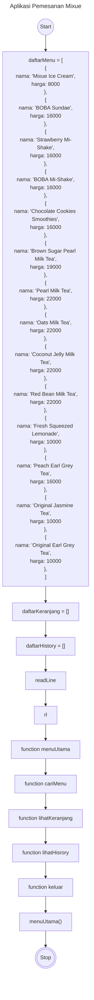

# Flowchart Aplikasi Pemesanan Mixue

```mermaid
---
    title: Aplikasi Pemesanan Mixue
---
flowchart TD
    start@{shape: circle, label: "Start"}
    stop@{shape: dbl-circ, label: "Stop"}
    daftarMenu@{shape: rect, label: "daftarMenu = [
        {
            nama: 'Mixue Ice Cream',
            harga: 8000
        },
        {
            nama: 'BOBA Sundae',
            harga: 16000
        },
        {
            nama: 'Strawberry Mi-Shake',
            harga: 16000
        },
        {
            nama: 'BOBA Mi-Shake',
            harga: 16000
        },
        {
            nama: 'Chocolate Cookies Smoothies',
            harga: 16000
        },
        {
            nama: 'Brown Sugar Pearl Milk Tea',
            harga: 19000
        },
        {
            nama: 'Pearl Milk Tea',
            harga: 22000
        },
        {
            nama: 'Oats Milk Tea',
            harga: 22000
        },
        {
            nama: 'Coconut Jelly Milk Tea',
            harga: 22000
        },
        {
            nama: 'Red Bean Milk Tea',
            harga: 22000
        },
        {
            nama: 'Fresh Squeezed Lemonade',
            harga: 10000
        },
        {
            nama: 'Peach Earl Grey Tea',
            harga: 16000
        },
        {
            nama: 'Original Jasmine Tea',
            harga: 10000
        },
        {
            nama: 'Original Earl Grey Tea',
            harga: 10000
        },
    ]"}
    daftarKeranjang@{shape: rect, label: "daftarKeranjang = []"}
    daftarHistory@{shape: rect, label: "daftarHistory = []"}
    readLine@{shape: rect, label: readLine}
    rl@{shape: rect, label: rl}
    menuUtama@{shape: rect, label: "function menuUtama"}
    cariMenu@{shape: rect, label: "function cariMenu"}
    lihatKeranjang@{shape: rect, label: "function lihatKeranjang"}
    lihatHistory@{shape: rect, label: "function lihatHisrory"}
    keluar@{shape: rect, label: "function keluar"}
    callMenuUtama@{shape: rect, label: "menuUtama()"}


    start --> daftarMenu --> daftarKeranjang --> daftarHistory --> readLine --> rl --> menuUtama --> cariMenu --> lihatKeranjang --> lihatHistory --> keluar --> callMenuUtama --> stop
```