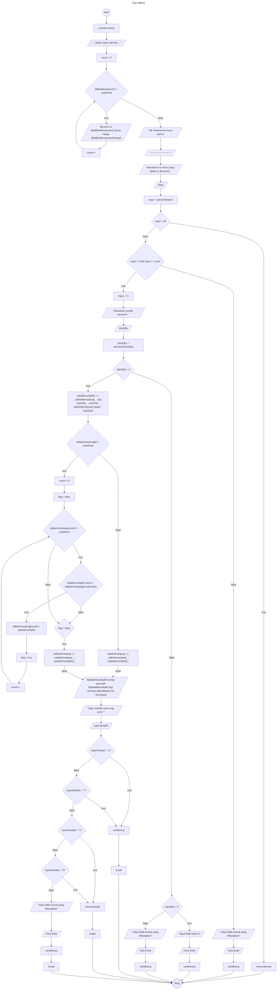

# Flowchart Cari Menu

```mermaid
---
    title: Cari Menu
---
flowchart TD
    start@{shape: circle, label: Start}
    stop@{shape: dbl-circ, label: Stop}

    consoleClear@{shape: rect, label: "console.clear()"}
    outputJudul@{shape: lean-r, label: '"--- Daftar Menu MIXUE ---"'}
    count@{shape: rect, label: count = 0}
    decis1@{shape: diamond, label: "daftarMenu[count] != undefined"}
    outputMenu@{shape: lean-r, label: "'${count+1}. ${daftarMenu[count].nama}, Harga: ${daftarMenu[count].harga}'"}
    countPlus@{shape: rect, label: count++}
    outputKembaliMenuUtama@{shape: lean-r, label: '" 99. Kembali ke menu utama"'}
    outputGarisAkhirMenu@{shape: lean-r, label: '"-------------------------"'}
    outputQuestInput@{shape: lean-r, label: "'Masukkan no menu yang dipilih (1-${count}): '"}
    input@{shape: lean-r, label: input}
    parseInput@{shape: rect, label: input = parseInt(input)}
    decis2@{shape: diamond, label: input = 99}
    decis2True@{shape: rect, label: "menuUtama()"}
    decis3@{shape: diamond, label: input > 0 && input <= count}
    outputErrorInput@{shape: lean-r, label: '"Input tidak sesuai yang diharapkan"'}
    inputMin@{shape: rect, label: input -= 1}
    outputQuestInputQty@{shape: lean-r, label: '"Masukkan jumlah pesanan: "'}
    inputQty@{shape: lean-r, label: inputQty}
    parseInputQty@{shape: rect, label: inputQty = parseInt(inputQty)}
    decis4@{shape: diamond, label: inputQty > 0}
    dataMenuDipilih@{shape: rect, label: "dataMenuDipilih = { ...daftarMenu[input], ...qty: inputQty ...subTotal: daftarMenu[input].harga * inputQty}"}
    decis5@{shape: diamond, label: "daftarKeranjang[0] != undefined"}
    countDecis5@{shape: rect, label: count = 0}
    flag@{shape: rect, label: flag = false}
    decis6@{shape: diamond, label: "daftarKeranjang[count] != undefined"}
    decis7@{shape: diamond, label: "dataMenuDipilih.nama = daftarKeranjang[count].nama"}
    decis7True@{shape: rect, label: "daftarKeranjang[count] = dataMenuDipilih"}
    flagTrue@{shape: rect, label: flag = true}
    countPlusDecis6@{shape: rect, label: count++}
    decis8@{shape: diamond, label: flag = false}
    decis8True@{shape: rect, label: "daftarKeranjang = [ ...daftarKeranjang, ...[dataMenuDipilih] ]"}
    decis5False@{shape: rect, label: "daftarKeranjang = [ ...daftarKeranjang, ...[dataMenuDipilih] ]"}
    decis3False@{shape: lean-r, label: Click Enter}
    callCariMenu@{shape: rect, label: "cariMenu()"}
    decis9@{shape: diamond, label: inputQty = 0}
    outputDecis9@{shape: lean-r, label: '"Input tidak boleh 0"'}
    decis9True@{shape: lean-r, label: Click Enter}
    outputDecis9False@{shape: lean-r, label: '"Input tidak sesuai yang diharapkan"'}
    callCariMenu2@{shape: rect, label: "cariMenu()"}
    decis9False@{shape: lean-r, label: Click Enter}
    callCariMenu3@{shape: rect, label: "cariMenu()"}
    outputKet@{shape: lean-r, label: "*${dataMenuDipilih.nama} sejumlah ${dataMenuDipilih.qty} berhasil ditambahkan ke keranjang*"}
    outputTambah@{shape: lean-r, label: '"Ingin memilih menu lagi (y/n)? "'}
    inputTambah@{shape: lean-r, label: inputTambah}
    case1Tambah@{shape: diamond, label: inputTambah = "y"}
    case2Tambah@{shape: diamond, label: inputTambah = "Y"}
    case3Tambah@{shape: diamond, label: inputTambah = "n"}
    case4Tambah@{shape: diamond, label: inputTambah = "N"}
    defaultOutputTambah@{shape: lean-r, label: '"*Input tidak sesuai yang diharapkan*"'}
    defaultInputTambah@{shape: lean-r, label: Click Enter}
    callCariMenu4@{shape: rect, label: "cariMenu()"}
    callCariMenu5@{shape: rect, label: "cariMenu()"}
    callMenuUtama@{shape: rect, label: "menuUtama()"}
    break1@{shape: rect, label: break}
    break2@{shape: rect, label: break}
    break3@{shape: rect, label: break}


    start --> consoleClear --> outputJudul --> count --> decis1
    decis1 -- true --> outputMenu --> countPlus
    countPlus --> decis1
    decis1 -- false --> outputKembaliMenuUtama --> outputGarisAkhirMenu --> outputQuestInput --> input
    input --> parseInput --> decis2 -- true --> decis2True
    decis2 -- false --> decis3
    decis3 -- true --> inputMin --> outputQuestInputQty --> inputQty --> parseInputQty
    parseInputQty --> decis4 -- true --> dataMenuDipilih
    dataMenuDipilih --> decis5 -- true --> countDecis5 --> flag --> decis6
    decis6 -- true --> decis7 -- true --> decis7True --> flagTrue --> countPlusDecis6
    countPlusDecis6 --> decis6
    decis7 -- false --> decis8 -- true --> decis8True
    decis5 -- false --> decis5False
    decis3 -- false --> outputErrorInput --> decis3False --> callCariMenu
    decis4 -- false --> decis9 -- true --> outputDecis9 --> decis9True --> callCariMenu2
    decis9 -- false --> outputDecis9False --> decis9False --> callCariMenu3
    decis6 -- false --> decis8
    decis5False -- false --> outputKet
    decis8True -- false --> outputKet
    outputKet --> outputTambah --> inputTambah
    inputTambah --> case1Tambah -- true --> callCariMenu4
    case1Tambah -- false --> case2Tambah -- true --> callCariMenu4 --> break1
    case2Tambah -- false --> case3Tambah -- true --> callMenuUtama
    case3Tambah -- false --> case4Tambah -- true --> callMenuUtama --> break2
    case4Tambah -- false --> defaultOutputTambah --> defaultInputTambah --> callCariMenu5 --> break3


    decis2True --> stop
    callCariMenu --> stop
    callCariMenu2 --> stop
    callCariMenu3 --> stop
    break1 --> stop
    break2 --> stop
    break3 --> stop


```