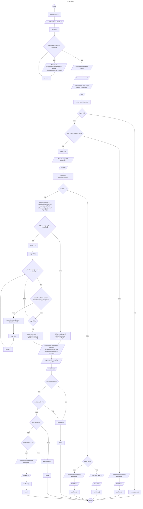

# Flowchart Cari Menu

```mermaid
---
    title: Cari Menu
---
flowchart TD
    start@{shape: circle, label: Start}
    stop@{shape: dbl-circ, label: Stop}

    consoleClear@{shape: rect, label: "console.clear()"}
    outputJudul@{shape: lean-r, label: '"--- Daftar Menu MIXUE ---"'}
    count@{shape: rect, label: count = 0}
    cekMenuMasihAda@{shape: diamond, label: "daftarMenu[count] != undefined"}
    outputMenu@{shape: lean-r, label: "'${count+1}. ${daftarMenu[count].nama}, Harga: ${daftarMenu[count].harga}'"}
    countPlus@{shape: rect, label: count++}
    outputKembaliMenuUtama@{shape: lean-r, label: '" 99. Kembali ke menu utama"'}
    outputGarisAkhirMenu@{shape: lean-r, label: '"-------------------------"'}
    outputQuestInput@{shape: lean-r, label: "'Masukkan no menu yang dipilih (1-${count}): '"}
    input@{shape: lean-r, label: input}
    parseInput@{shape: rect, label: input = parseInt(input)}
    cekInputKembali@{shape: diamond, label: input = 99}
    kembaliMenuUtama@{shape: rect, label: "menuUtama()"}
    cekInputValid@{shape: diamond, label: input > 0 && input <= count}
    outputErrorInput@{shape: lean-r, label: '"Input tidak sesuai yang diharapkan"'}
    inputMin@{shape: rect, label: input -= 1}
    outputQuestInputQty@{shape: lean-r, label: '"Masukkan jumlah pesanan: "'}
    inputQty@{shape: lean-r, label: inputQty}
    parseInputQty@{shape: rect, label: inputQty = parseInt(inputQty)}
    cekQtyValid@{shape: diamond, label: inputQty > 0}
    dataMenuDipilih@{shape: rect, label: "dataMenuDipilih = { ...daftarMenu[input], qty: inputQty, subTotal: daftarMenu[input].harga * inputQty}"}
    cekKeranjangKosong@{shape: diamond, label: "daftarKeranjang[0] != undefined"}
    countKeranjang@{shape: rect, label: count = 0}
    flag@{shape: rect, label: flag = false}
    cekItemKeranjangMasihAda@{shape: diamond, label: "daftarKeranjang[count] != undefined"}
    cekMenuSama@{shape: diamond, label: "dataMenuDipilih.nama = daftarKeranjang[count].nama"}
    updateItemKeranjang@{shape: rect, label: "daftarKeranjang[count] = dataMenuDipilih"}
    flagTrue@{shape: rect, label: flag = true}
    countPlusKeranjang@{shape: rect, label: count++}
    cekMenuBelumKetemu@{shape: diamond, label: flag = false}
    tambahItemBaru@{shape: rect, label: "daftarKeranjang = [ ...daftarKeranjang, dataMenuDipilih ]"}
    tambahItemPertama@{shape: rect, label: "daftarKeranjang = [ ...daftarKeranjang, dataMenuDipilih ]"}
    enterInvalidInput@{shape: lean-r, label: Click Enter}
    callCariMenu@{shape: rect, label: "cariMenu()"}
    cekQtyNol@{shape: diamond, label: inputQty = 0}
    outputQtyNol@{shape: lean-r, label: '"Input tidak boleh 0"'}
    enterQtyNol@{shape: lean-r, label: Click Enter}
    outputQtyInvalid@{shape: lean-r, label: '"Input tidak sesuai yang diharapkan"'}
    callCariMenu2@{shape: rect, label: "cariMenu()"}
    enterQtyInvalid@{shape: lean-r, label: Click Enter}
    callCariMenu3@{shape: rect, label: "cariMenu()"}
    outputKet@{shape: lean-r, label: "*${dataMenuDipilih.nama} sejumlah ${dataMenuDipilih.qty} berhasil ditambahkan ke keranjang*"}
    outputTambah@{shape: lean-r, label: '"Ingin memilih menu lagi (y/n)? "'}
    inputTambah@{shape: lean-r, label: inputTambah}
    cekTambahY@{shape: diamond, label: inputTambah = "y"}
    cekTambahYKapital@{shape: diamond, label: inputTambah = "Y"}
    cekTambahN@{shape: diamond, label: inputTambah = "n"}
    cekTambahNKapital@{shape: diamond, label: inputTambah = "N"}
    outputTambahInvalid@{shape: lean-r, label: '"*Input tidak sesuai yang diharapkan*"'}
    enterTambahInvalid@{shape: lean-r, label: Click Enter}
    callCariMenu4@{shape: rect, label: "cariMenu()"}
    callCariMenu5@{shape: rect, label: "cariMenu()"}
    callMenuUtama@{shape: rect, label: "menuUtama()"}
    break1@{shape: rect, label: break}
    break2@{shape: rect, label: break}
    break3@{shape: rect, label: break}


    start --> consoleClear --> outputJudul --> count --> cekMenuMasihAda
    cekMenuMasihAda -- true --> outputMenu --> countPlus
    countPlus --> cekMenuMasihAda
    cekMenuMasihAda -- false --> outputKembaliMenuUtama --> outputGarisAkhirMenu --> outputQuestInput --> input
    input --> parseInput --> cekInputKembali -- true --> kembaliMenuUtama
    cekInputKembali -- false --> cekInputValid
    cekInputValid -- true --> inputMin --> outputQuestInputQty --> inputQty --> parseInputQty
    parseInputQty --> cekQtyValid -- true --> dataMenuDipilih
    dataMenuDipilih --> cekKeranjangKosong -- true --> countKeranjang --> flag --> cekItemKeranjangMasihAda
    cekItemKeranjangMasihAda -- true --> cekMenuSama -- true --> updateItemKeranjang --> flagTrue --> countPlusKeranjang
    countPlusKeranjang --> cekItemKeranjangMasihAda
    cekMenuSama -- false --> cekMenuBelumKetemu -- true --> tambahItemBaru
    cekKeranjangKosong -- false --> tambahItemPertama
    cekInputValid -- false --> outputErrorInput --> enterInvalidInput --> callCariMenu
    cekQtyValid -- false --> cekQtyNol -- true --> outputQtyNol --> enterQtyNol --> callCariMenu2
    cekQtyNol -- false --> outputQtyInvalid --> enterQtyInvalid --> callCariMenu3
    cekItemKeranjangMasihAda -- false --> cekMenuBelumKetemu
    tambahItemPertama --> outputKet
    tambahItemBaru --> outputKet
    outputKet --> outputTambah --> inputTambah
    inputTambah --> cekTambahY -- true --> callCariMenu4
    cekTambahY -- false --> cekTambahYKapital -- true --> callCariMenu4 --> break1
    cekTambahYKapital -- false --> cekTambahN -- true --> callMenuUtama
    cekTambahN -- false --> cekTambahNKapital -- true --> callMenuUtama --> break2
    cekTambahNKapital -- false --> outputTambahInvalid --> enterTambahInvalid --> callCariMenu5 --> break3


    kembaliMenuUtama --> stop
    callCariMenu --> stop
    callCariMenu2 --> stop
    callCariMenu3 --> stop
    break1 --> stop
    break2 --> stop
    break3 --> stop


```
