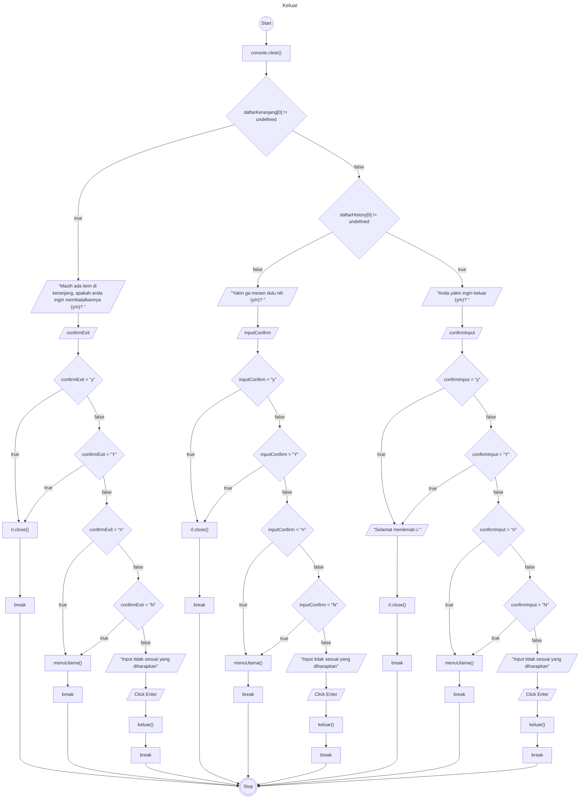

# Flowchart Keluar

```mermaid
---
    title: Keluar
---
flowchart TD
    start@{shape: circle, label: Start}
    stop@{shape: dbl-circ, label: Stop}
    consoleClear@{shape: rect, label: "console.clear()"}
    cekKeranjangKosong@{shape: diamond, label: "daftarKeranjang[0] != undefined"}
    cekHistoryKosong@{shape: diamond, label: "daftarHistory[0] != undefined"}
    outputAdaKeranjang@{shape: lean-r, label: '"Masih ada item di keranjang, apakah anda ingin membatalkannya (y/n)? "'}
    confirmExit@{shape: lean-r, label: confirmExit}
    cekConfirmExitY@{shape: diamond, label: confirmExit = "y"}
    cekConfirmExitYKapital@{shape: diamond, label: confirmExit = "Y"}
    cekConfirmExitN@{shape: diamond, label: confirmExit = "n"}
    cekConfirmExitNKapital@{shape: diamond, label: confirmExit = "N"}
    close1@{shape: rect, label: "rl.close()"}
    close2@{shape: rect, label: "rl.close()"}
    outputAdaHistory@{shape: lean-r, label: '"Selamat menikmati☺️"'}
    callMenuUtama1@{shape: rect, label: "menuUtama()"}
    outputError1@{shape: lean-r, label: '"Input tidak sesuai yang diharapkan"'}
    inputKosong1@{shape: lean-r, label: Click Enter}
    callKeluar1@{shape: rect, label: "keluar()"}
    outputConfirm@{shape: lean-r, label: '"Yakin ga mesen dulu nih (y/n)? "'}
    inputConfirm@{shape: lean-r, label: inputConfirm}
    cekInputConfirmY@{shape: diamond, label: inputConfirm = "y"}
    cekInputConfirmYKapital@{shape: diamond, label: inputConfirm = "Y"}
    cekInputConfirmN@{shape: diamond, label: inputConfirm = "n"}
    cekInputConfirmNKapital@{shape: diamond, label: inputConfirm = "N"}
    close3@{shape: rect, label: "rl.close()"}
    callMenuUtama2@{shape: rect, label: "menuUtama()"}
    outputError2@{shape: lean-r, label: '"Input tidak sesuai yang diharapkan"'}
    inputKosong2@{shape: lean-r, label: Click Enter}
    callKeluar2@{shape: rect, label: "keluar()"}
    cekConfirmInputY@{shape: diamond, label: confirmInput = "y"}
    cekConfirmInputYKapital@{shape: diamond, label: confirmInput = "Y"}
    cekConfirmInputN@{shape: diamond, label: confirmInput = "n"}
    cekConfirmInputNKapital@{shape: diamond, label: confirmInput = "N"}
    callMenuUtama3@{shape: rect, label: "menuUtama()"}
    outputError3@{shape: lean-r, label: '"Input tidak sesuai yang diharapkan"'}
    inputKosong3@{shape: lean-r, label: Click Enter}
    callKeluar3@{shape: rect, label: "keluar()"}
    outputConfirmInput@{shape: lean-r, label: '"Anda yakin ingin keluar (y/n)? "'}
    inputConfirmInput@{shape: lean-r, label: confirmInput}

    break1@{shape: rect, label: break}
    break2@{shape: rect, label: break}
    break3@{shape: rect, label: break}
    break4@{shape: rect, label: break}
    break5@{shape: rect, label: break}
    break6@{shape: rect, label: break}
    break7@{shape: rect, label: break}
    break8@{shape: rect, label: break}
    break9@{shape: rect, label: break}

    start --> consoleClear --> cekKeranjangKosong -- true --> outputAdaKeranjang --> confirmExit --> cekConfirmExitY -- true --> close1 --> break1
    cekConfirmExitY -- false --> cekConfirmExitYKapital -- true --> close1
    cekConfirmExitYKapital -- false --> cekConfirmExitN -- true --> callMenuUtama1 --> break2
    cekConfirmExitN -- false --> cekConfirmExitNKapital -- true --> callMenuUtama1
    cekConfirmExitNKapital -- false --> outputError1 --> inputKosong1 --> callKeluar1 --> break3
    cekKeranjangKosong -- false --> cekHistoryKosong -- true --> outputConfirmInput --> inputConfirmInput --> cekConfirmInputY -- true --> outputAdaHistory --> close2 --> break7
    cekConfirmInputY -- false --> cekConfirmInputYKapital -- true -->  outputAdaHistory
    cekConfirmInputYKapital -- false --> cekConfirmInputN -- true --> callMenuUtama3 --> break8
    cekConfirmInputN -- false --> cekConfirmInputNKapital -- true --> callMenuUtama3
    cekConfirmInputNKapital -- false --> outputError3 --> inputKosong3 --> callKeluar3 --> break9
    cekHistoryKosong -- false --> outputConfirm --> inputConfirm --> cekInputConfirmY -- true --> close3 --> break4
    cekInputConfirmY -- false --> cekInputConfirmYKapital -- true --> close3
    cekInputConfirmYKapital -- false --> cekInputConfirmN -- true --> callMenuUtama2 --> break5
    cekInputConfirmN -- false --> cekInputConfirmNKapital -- true --> callMenuUtama2
    cekInputConfirmNKapital -- false --> outputError2 --> inputKosong2 --> callKeluar2 --> break6


    break1 --> stop
    break2 --> stop
    break3 --> stop
    break4 --> stop
    break5 --> stop
    break6 --> stop
    break7 --> stop
    break8 --> stop
    break9 --> stop

```
