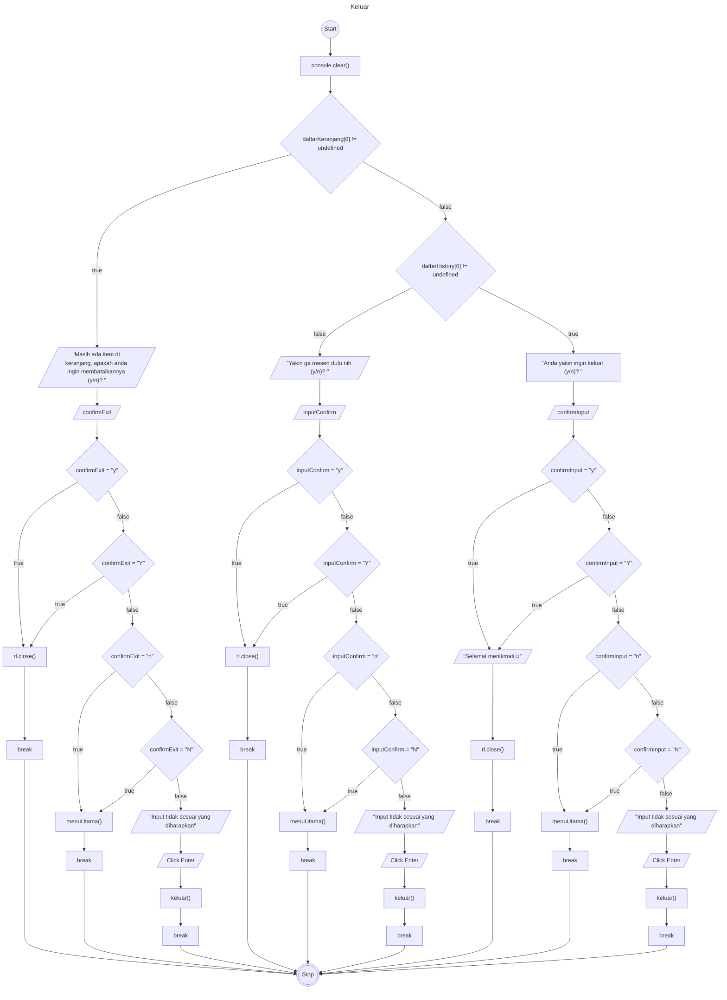

# Flowchart Keluar

```mermaid
---
    title: Keluar
---
flowchart TD
    start@{shape: circle, label: Start}
    stop@{shape: dbl-circ, label: Stop}
    consoleClear@{shape: rect, label: "console.clear()"}
    decis1@{shape: diamond, label: "daftarKeranjang[0] != undefined"}
    decis2@{shape: diamond, label: "daftarHistory[0] != undefined"}
    ouputAdaKeranjang@{shape: lean-r, label: '"Masih ada item di keranjang, apakah anda ingin membatalkannya (y/n)? "'}
    confirmExit@{shape: lean-r, label: confirmExit}
    decis3@{shape: diamond, label: confirmExit = "y"}
    decis4@{shape: diamond, label: confirmExit = "Y"}
    decis5@{shape: diamond, label: confirmExit = "n"}
    decis6@{shape: diamond, label: confirmExit = "N"}
    close1@{shape: rect, label: "rl.close()"}
    close2@{shape: rect, label: "rl.close()"}
    ouputAdaHistory@{shape: lean-r, label: '"Selamat menikmati☺️"'}
    callMenuUtama1@{shape: rect, label: "menuUtama()"}
    outputError1@{shape: lean-r, label: '"Input tidak sesuai yang diharapkan"'}
    inputKosong1@{shape: lean-r, label: Click Enter}
    callKeluar1@{shape: rect, label: "keluar()"}
    outputConfirm@{shape: lean-r, label: '"Yakin ga mesen dulu nih (y/n)? "'}
    inputConfirm@{shape: lean-r, label: inputConfirm}
    decis7@{shape: diamond, label: inputConfirm = "y"}
    decis8@{shape: diamond, label: inputConfirm = "Y"}
    decis9@{shape: diamond, label: inputConfirm = "n"}
    decis10@{shape: diamond, label: inputConfirm = "N"}
    close3@{shape: rect, label: "rl.close()"}
    callMenuUtama2@{shape: rect, label: "menuUtama()"}
    outputError2@{shape: lean-r, label: '"Input tidak sesuai yang diharapkan"'}
    inputKosong2@{shape: lean-r, label: Click Enter}
    callKeluar2@{shape: rect, label: "keluar()"}
    decis11@{shape: diamond, label: confirmInput = "y"}
    decis12@{shape: diamond, label: confirmInput = "Y"}
    decis13@{shape: diamond, label: confirmInput = "n"}
    decis14@{shape: diamond, label: confirmInput = "N"}
    callMenuUtama3@{shape: rect, label: "menuUtama()"}
    outputError3@{shape: lean-r, label: '"Input tidak sesuai yang diharapkan"'}
    inputKosong3@{shape: lean-r, label: Click Enter}
    callKeluar3@{shape: rect, label: "keluar()"}
    outputConfirmInput@{shpae: lean-r, label: '"Anda yakin ingin keluar (y/n)? "'}
    inputConfirmInput@{shape: lean-r, label: confirmInput}

    break1@{shape: rect, label: break}
    break2@{shape: rect, label: break}
    break3@{shape: rect, label: break}
    break4@{shape: rect, label: break}
    break5@{shape: rect, label: break}
    break6@{shape: rect, label: break}
    break7@{shape: rect, label: break}
    break8@{shape: rect, label: break}
    break9@{shape: rect, label: break}

    start --> consoleClear --> decis1 -- true --> ouputAdaKeranjang --> confirmExit --> decis3 -- true --> close1 --> break1
    decis3 -- false --> decis4 -- true --> close1
    decis4 -- false --> decis5 -- true --> callMenuUtama1 --> break2
    decis5 -- false --> decis6 -- true --> callMenuUtama1
    decis6 -- false --> outputError1 --> inputKosong1 --> callKeluar1 --> break3 
    decis1 -- false --> decis2 -- true --> outputConfirmInput --> inputConfirmInput --> decis11 -- true --> ouputAdaHistory --> close2 --> break7
    decis11 -- false --> decis12 -- true -->  ouputAdaHistory
    decis12 -- false --> decis13 -- true --> callMenuUtama3 --> break8
    decis13 -- false --> decis14 -- true --> callMenuUtama3
    decis14 -- false --> outputError3 --> inputKosong3 --> callKeluar3 --> break9
    decis2 -- false --> outputConfirm --> inputConfirm --> decis7 -- true --> close3 --> break4
    decis7 -- false --> decis8 -- true --> close3
    decis8 -- false --> decis9 -- true --> callMenuUtama2 --> break5
    decis9 -- false --> decis10 -- true --> callMenuUtama2
    decis10 -- false --> outputError2 --> inputKosong2 --> callKeluar2 --> break6
    

    break1 --> stop
    break2 --> stop
    break3 --> stop
    break4 --> stop
    break5 --> stop
    break6 --> stop
    break7 --> stop
    break8 --> stop
    break9 --> stop

```