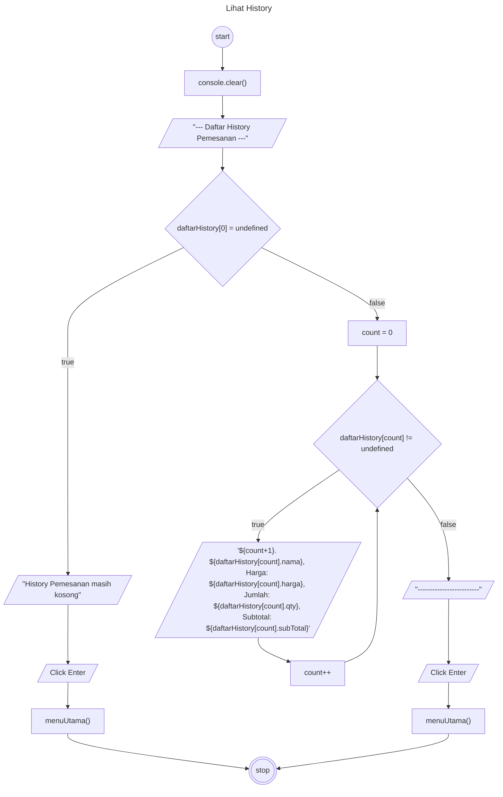

# FLowchart Lihat History

```mermaid
---
    title: Lihat History
---
flowchart TD
    start@{shape: circle, label: start}
    stop@{shape: dbl-circ, label: stop}
    consoleClear@{shape: rect, label: "console.clear()"}
    outputJudul@{shape: lean-r, label: '"--- Daftar History Pemesanan ---"'}
    cekHistoryKosong@{shape: diamond, label: "daftarHistory[0] = undefined"}
    outputKosong@{shape: lean-r, label: '"History Pemesanan masih kosong"'}
    inputKosong1@{shape: lean-r, label: Click Enter}
    callMenuUtama1@{shape: rect, label: "menuUtama()"}
    count@{shape: rect, label: count = 0}
    cekHistoryMasihAda@{shape: diamond, label: "daftarHistory[count] != undefined"}
    outputHistory@{shape: lean-r, label: "'${count+1}. ${daftarHistory[count].nama}, Harga: ${daftarHistory[count].harga}, Jumlah: ${daftarHistory[count].qty}, Subtotal: ${daftarHistory[count].subTotal}'"}
    countPlus@{shape: rect, label: count++}
    outputBatas@{shape: lean-r, label: '"-------------------------"'}
    inputKosong2@{shape: lean-r, label: Click Enter}
    callMenuUtama2@{shape: rect, label: "menuUtama()"}


    start --> consoleClear --> outputJudul --> cekHistoryKosong -- true --> outputKosong --> inputKosong1 --> callMenuUtama1 --> stop
    cekHistoryKosong -- false --> count --> cekHistoryMasihAda -- true --> outputHistory --> countPlus --> cekHistoryMasihAda
    cekHistoryMasihAda -- false --> outputBatas --> inputKosong2 --> callMenuUtama2 --> stop

```
