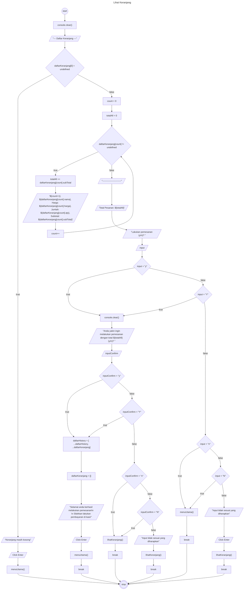

# FLowchart Lihat Keranjang

```mermaid
---
    title: Lihat Keranjang
---
flowchart TD
    start@{shape: circle, label: start}
    stop@{shape: dbl-circ, label: stop}
    consoleClear1@{shape: rect, label: "console.clear()"}
    outputJudul@{shape: lean-r, label: '"--- Daftar Keranjang ---"'}
    decis1@{shape: diamond, label: "daftarKeranjang[0] = undefined"}
    outputKosong@{shape: lean-r, label: '"Keranjang masih kosong"'}
    inputKosong1@{shape: lean-r, label: Click Enter}
    callMenuUtama1@{shape: rect, label: "menuUtama()"}
    count@{shape: rect, label: count = 0}
    totalAll@{shape: rect, label: totalAll = 0}
    decis2@{shape: diamond, label: "daftarKeranjang[count] != undefined"}
    sumTotal@{shape: rect, label: "totalAll += daftarKeranjang[count].subTotal"}
    outputKeranjang@{shape: lean-r, label: "'${count+1}. ${daftarKeranjang[count].nama}, Harga: ${daftarKeranjang[count].harga}, Jumlah: ${daftarKeranjang[count].qty}, Subtotal: ${daftarKeranjang[count].subTotal}'"}
    countPlus@{shape: rect, label: count++}
    outputBatasBawah@{shape: lean-r, label: '"-------------------------"'}
    outputTotalAll@{shape: lean-r, label: "'Total Pesanan: ${totalAll}'"}
    outputLakukanPesan@{shape: lean-r, label: '"Lakukan pemesanan (y/n)? "'}
    input@{shape: lean-r, label: input}
    decis3@{shape: diamond, label: input = "y"}
    decis4@{shape: diamond, label: input = "Y"}
    decis5@{shape: diamond, label: input = "n"}
    decis6@{shape: diamond, label: input = "N"}
    consoleClear2@{shape: rect, label: "console.clear()"}
    outputConfirm@{shape: lean-r, label: '"Anda yakin ingin melakukan pemesanan dengan total ${totalAll} (y/n)? "'}
    inputConfirm@{shape: lean-r, label: inputConfirm}
    callMenuUtama2@{shape: rect, label: "menuUtama()"}
    break1@{shape: rect, label: break}
    outputError1@{shape: lean-r, label: '"Input tidak sesuai yang diharapkan"'}
    inputKosong2@{shape: lean-r, label: Click Enter}
    callLihatKeranjang1@{shape: rect, label: "lihatKeranjang()"}
    break2@{shape: rect, label: break}
    decis7@{shape: diamond, label: inputConfirm = "y"}
    decis8@{shape: diamond, label: inputConfirm = "Y"}
    decis9@{shape: diamond, label: inputConfirm = "n"}
    decis10@{shape: diamond, label: inputConfirm = "N"}
    break3@{shape: rect, label: break}
    break4@{shape: rect, label: break}
    break5@{shape: rect, label: break}
    assignDaftarHistory@{shape: rect, label: "daftarHistory = [ ...daftarHistory, ...daftarKeranjang]"}
    assignDaftarKeranjang@{shape: rect, label: "daftarKeranjang = []"}
    outputBerhasil@{shape: lean-r, label: '"Selamat anda berhasil melakukan pemesanan\n \n Silahkan lakukan pembayaran di kasir"'}
    inputKosong3@{shape: lean-r, label: Click Enter}
    callMenuUtama2@{shape: rect, label: "menuUtama()"}
    callMenuUtama3@{shape: rect, label: "menuUtama()"}
    callLihatKeranjang2@{shape: rect, label: "lihatKeranjang()"}
    outputError2@{shape: lean-r, label: '"Input tidak sesuai yang diharapkan"'}
    callLihatKeranjang3@{shape: rect, label: "lihatKeranjang()"}


    start --> consoleClear1 --> outputJudul --> decis1 -- true --> outputKosong --> inputKosong1 --> callMenuUtama1 --> stop
    decis1 -- false --> count --> totalAll --> decis2 -- true --> sumTotal --> outputKeranjang --> countPlus --> decis2
    decis2 -- false --> outputBatasBawah --> outputTotalAll --> outputLakukanPesan --> input --> decis3 -- true --> consoleClear2 --> outputConfirm --> inputConfirm
    decis3 -- false --> decis4 -- true --> consoleClear2
    decis4 -- false --> decis5 -- true --> callMenuUtama2--> break1
    decis5 -- false --> decis6 -- true --> callMenuUtama2
    decis6 -- false --> outputError1 --> inputKosong2 --> callLihatKeranjang1 --> break2
    inputConfirm --> decis7 -- true --> assignDaftarHistory --> assignDaftarKeranjang --> outputBerhasil --> inputKosong3 --> callMenuUtama3 --> break3
    decis7 -- false --> decis8 -- true --> assignDaftarHistory
    decis8 -- false --> decis9 -- true --> callLihatKeranjang2 --> break4
    decis9 -- false --> decis10 -- true --> callLihatKeranjang2
    decis10 -- false --> outputError2 --> callLihatKeranjang3 --> break5

    break1 --> stop
    break2 --> stop
    break3 --> stop
    break4 --> stop
    break5 --> stop

```