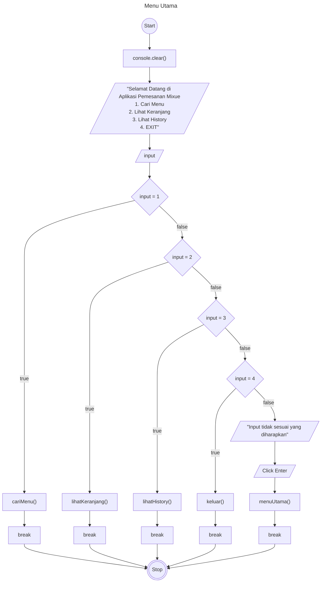

# Flowchart Menu Utama

```mermaid
---
    title: Menu Utama
---
flowchart TD
    start@{shape: circle, label: Start}
    stop@{shape: dbl-circ, label: Stop}
    consoleClear@{shape: rect, label: "console.clear()"}
    outputMenu@{shape: lean-r, label: '"Selamat Datang di Aplikasi Pemesanan Mixue
    1. Cari Menu
    2. Lihat Keranjang
    3. Lihat History
    4. EXIT"'}

    input@{shape: lean-r, label: input}

    case1Input@{shape: diamond, label: input = 1}
    true1Input@{shape: rect, label: "cariMenu()"}
    break1@{shape: rect, label: break}

    case2Input@{shape: diamond, label: input = 2}
    true2Input@{shape: rect, label: "lihatKeranjang()"}
    break2@{shape: rect, label: break}

    case3Input@{shape: diamond, label: input = 3}
    true3Input@{shape: rect, label: "lihatHistory()"}
    break3@{shape: rect, label: break}

    case4Input@{shape: diamond, label: input = 4}
    true4Input@{shape: rect, label: "keluar()"}
    break4@{shape: rect, label: break}

    outputDefaultInput@{shape: lean-r, label: '"Input tidak sesuai yang diharapkan"'}
    defaultInput@{shape: lean-r, label: Click Enter}
    defaultProses@{shape: rect, label: "menuUtama()"}
    break5@{shape: rect, label: break}


    start --> consoleClear --> outputMenu --> input
    input --> case1Input -- true --> true1Input --> break1
    case1Input -- false --> case2Input -- true --> true2Input --> break2
    case2Input -- false --> case3Input -- true --> true3Input --> break3
    case3Input -- false --> case4Input -- true --> true4Input --> break4
    case4Input -- false --> outputDefaultInput --> defaultInput --> defaultProses --> break5

    break1 --> stop
    break2 --> stop
    break3 --> stop
    break4 --> stop
    break5 --> stop

```