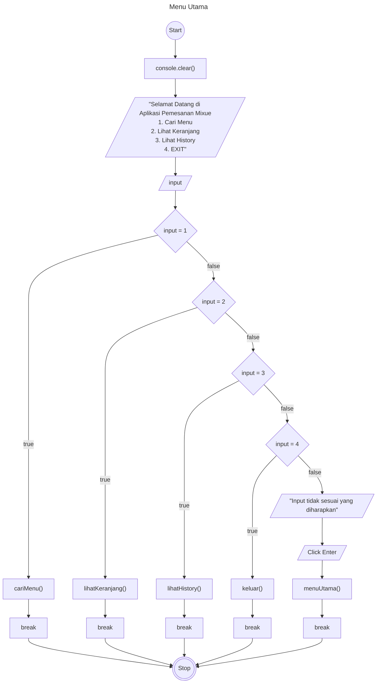

# Flowchart Menu Utama

```mermaid
---
    title: Menu Utama
---
flowchart TD
    start@{shape: circle, label: Start}
    stop@{shape: dbl-circ, label: Stop}
    consoleClear@{shape: rect, label: "console.clear()"}
    outputMenu@{shape: lean-r, label: '"Selamat Datang di Aplikasi Pemesanan Mixue
    1. Cari Menu
    2. Lihat Keranjang
    3. Lihat History
    4. EXIT"'}

    input@{shape: lean-r, label: input}

    cekInputCariMenu@{shape: diamond, label: input = 1}
    callCariMenu@{shape: rect, label: "cariMenu()"}
    break1@{shape: rect, label: break}

    cekInputLihatKeranjang@{shape: diamond, label: input = 2}
    callLihatKeranjang@{shape: rect, label: "lihatKeranjang()"}
    break2@{shape: rect, label: break}

    cekInputLihatHistory@{shape: diamond, label: input = 3}
    callLihatHistory@{shape: rect, label: "lihatHistory()"}
    break3@{shape: rect, label: break}

    cekInputKeluar@{shape: diamond, label: input = 4}
    callKeluar@{shape: rect, label: "keluar()"}
    break4@{shape: rect, label: break}

    outputErrorInput@{shape: lean-r, label: '"Input tidak sesuai yang diharapkan"'}
    enterErrorInput@{shape: lean-r, label: Click Enter}
    callMenuUtama@{shape: rect, label: "menuUtama()"}
    break5@{shape: rect, label: break}


    start --> consoleClear --> outputMenu --> input
    input --> cekInputCariMenu -- true --> callCariMenu --> break1
    cekInputCariMenu -- false --> cekInputLihatKeranjang -- true --> callLihatKeranjang --> break2
    cekInputLihatKeranjang -- false --> cekInputLihatHistory -- true --> callLihatHistory --> break3
    cekInputLihatHistory -- false --> cekInputKeluar -- true --> callKeluar --> break4
    cekInputKeluar -- false --> outputErrorInput --> enterErrorInput --> callMenuUtama --> break5

    break1 --> stop
    break2 --> stop
    break3 --> stop
    break4 --> stop
    break5 --> stop

```
